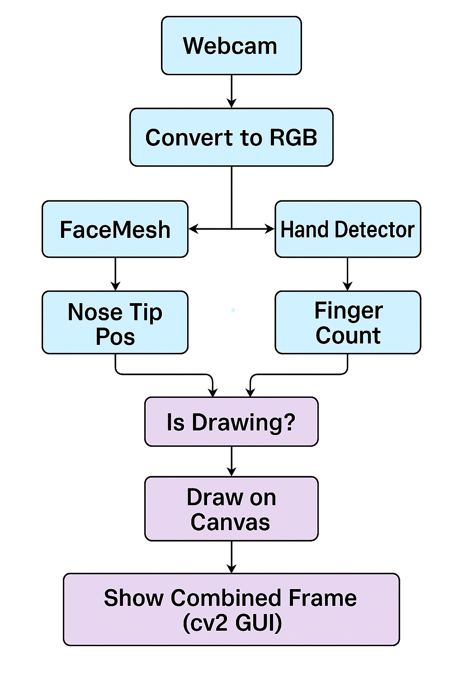

# Mooku Kond Iksha Inja Varakam 🎯

## Basic Detail
### Team Name: Fractulus

### Team Members
- Team Lead: Mathew Joseph T A - Adi Shankara Institute of Engineeering and Technology
- Member 2: Daniel Joshy - Adi Shankara Institute of Engineeering and Technology

### Project Description
A computer vision-based fun project that lets you draw on-screen using your nose! Gesture with your hand to start drawing, pause, or quit — all hands-free!

### The Problem (that doesn't exist)
Artists struggle with traditional tools... what if you had to draw only using your nose?

### The Solution (that nobody asked for)
We let you draw by tracking your nose via webcam using MediaPipe FaceMesh and hand gestures. If you raise 3 fingers, you draw. Raise 2 hands? Quit. Raise 1? Clear the canvas.

## Technical Details
### Technologies/Components Used
For Software:
- opencv-python
- mediapipe
- numpy

For Hardware:
- Webcam (Laptop or USB camera)

### Implementation
For Software:
# Installation
pip install opencv-python mediapipe numpy

# Run
python eksha_inna_varakum.py

### Project Documentation
For Software:

# Screenshots (Add at least 3)

# Diagrams

### Project Demo
# Video
[▶️ Click to watch the demo](assets/Video%20recording.mp4)

## Team Contributions
- Mathew Joseph T A: Development
- Daniel Joshy : Idea and Design

---
Made with ❤️ at TinkerHub Useless Projects 

